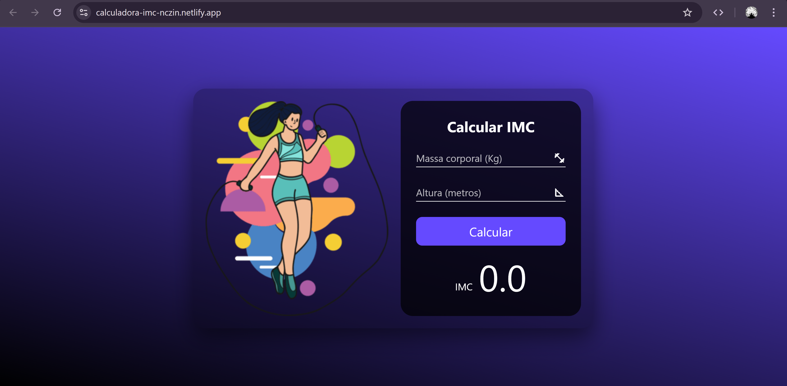

# ⚖️ Calculadora de IMC - Nikolas Dev

  

A **Calculadora de IMC** é uma ferramenta de saúde e bem-estar desenvolvida por **nikolasdev**. Com uma interface moderna e ilustrativa, ela permite que os usuários calculem seu Índice de Massa Corporal de forma rápida, recebendo feedback instantâneo sobre sua categoria de peso.

🌐 **Acesse o projeto:** [calculadora-imc-nczin.netlify.app](https://calculadora-imc-nczin.netlify.app)

---

## ✨ Funcionalidades

* **📊 Cálculo Preciso:** Processamento imediato do IMC com base no peso (kg) e altura (m).
* **🎨 Interface Ilustrativa:** Design elegante que combina vetores modernos com uma UI limpa e funcional.
* **⚡ Feedback em Tempo Real:** Resultado exibido instantaneamente após o clique no botão calcular.
* **📱 Design Responsivo:** Experiência otimizada para qualquer dispositivo (Mobile e Desktop).

---

## 🛠 Tecnologias Utilizadas

Este projeto reforça a habilidade de **nikolasdev** em criar ferramentas úteis com tecnologias web puras:

* **HTML5:** Estruturação dos campos de entrada e organização do layout.
* **CSS3:** Estilização baseada em tons de roxo, tipografia moderna e alinhamento preciso.
* **JavaScript (Vanilla):** Lógica matemática para o cálculo do IMC: $IMC = \frac{peso}{altura^2}$.
* **Netlify:** Deploy e hospedagem.

---

## 🚀 Como Executar

1. Clone o repositório.
2. Abra o arquivo `index.html` no seu navegador.
3. Insira sua massa corporal e altura para obter o resultado.

---

## 👤 Desenvolvedor

Projeto assinado por **Nikolas Dev**.

> **Sobre:** aplicação que ajuda as pessoas através da tecnologia.

---

  💪 Cuide da sua saúde com a Calculadora do Nikolas!

